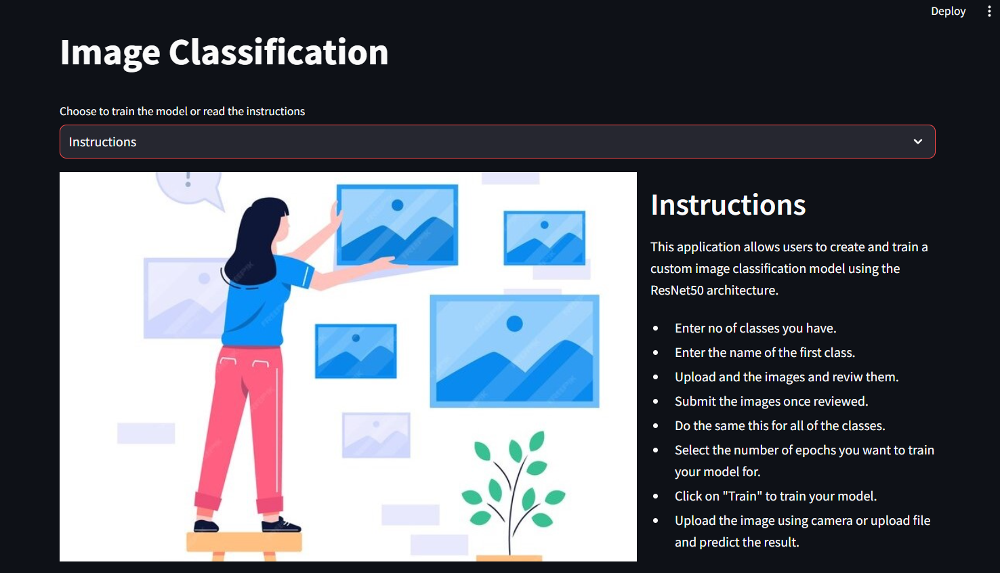

# Info
<B>Image Classification</B> This project is an interactive tool for creating and training image classification models. You can specify the number of classes, provide the names for those classes, upload images for each class, and then train a model to classify images into the specified classes.


The Model along with the dataloader are all made up from scratch by me using Tensorflow(for model),opencv and numpy(for image processing) and some basic built in python libraries.




##

# Setup  
```
git clone https://github.com/Pravesh1800/Image-Classification
``` 
```
cd Image-Classification
```
```
pip install -r requirements.txt
```

## Run the following command
```
streamlit run image.py
```
This should start the app,

## How to use it

<b>1</b>
[Select the number of classes that your model has.](https://github.com/Pravesh1800/Image-Classification/blob/main/image_classification/class.mp4)
<b>2</b> Enter the name of your class.
<video controls src="https://pravesh.portfoliomine.in/media/5f4a95d9163752de4bf70a922af0702a3e335a6e963236b9d9fd0bab.mp4" title="Title"></video>

<b>3</b> Click on 'Browse file' and select the images for those class.
<video controls src="https://pravesh.portfoliomine.in/media/95066290ce78f9b1c0ec357071048fc9697578945fb541a01b807eb6.mp4" title="Title"></video>

<b>4</b> Click on submit once you can see the names of your images.
<video controls src="https://pravesh.portfoliomine.in/media/cf6c23669fac4aa74128d9eaee9aa4067eb99c4a83dd1360d40dca63.mp4" title="Title"></video>

<b>5</b> Select the no of epochs you want to train the model for and click on 'train' to start training the model.
<video controls src="https://pravesh.portfoliomine.in/media/29d8ed3725b4baba1d037c8c6cadf0718ba5143b5c55fba53bd17194.mp4" title="Title"></video>

## Troubleshooting Tips

<b>1.</b> If you get this error it means the train directory is empty the error will not displayed onces you create a class
```
ValueError: No images found in directory train_data. Allowed formats: ('.bmp', '.gif', '.jpeg', '.jpg', '.png')
```

<b>2.</b>Always make sure that the "train_data" directory is empty before training a new model.

<b>3.</b>Make sure the images you are inserting are one of the following type.
```
'.bmp', '.gif', '.jpeg', '.jpg', '.png'
``` 

